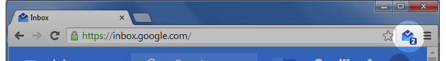

Inbox by Gmail Checker
======================

This is a derivative work of the [Google Mail Checker][] to work with Inbox by Gmail.

Features
--------

- Displays the unread count directly on the icon
- Click the icon to open your inbox in a new tab
- Set which account to use when signed into multiple Google accounts
- Optionally **set quiet hours** to hide the unread count during your peak productivity time

Installation
------------

Or manually:

1. Download or `git clone http://github.com/joeyespo/inbox-by-gmail-checker.git`
2. Open Chrome extensions and click on the `Load unpacked extension` button
3. Select the downloaded directory

Contributing
------------

1. Check the open issues or open a new issue to start a discussion around
   your feature idea or the bug you found
2. Fork the repository, make your changes, and add yourself to [Authors.md][]
3. Send a pull request

If your PR has been waiting a while, feel free to [ping me on Twitter](http://twitter.com/joeyespo).

[google mail checker]: http://developer.chrome.com/extensions/samples#google-mail-checker
[authors.md]: AUTHORS.md
